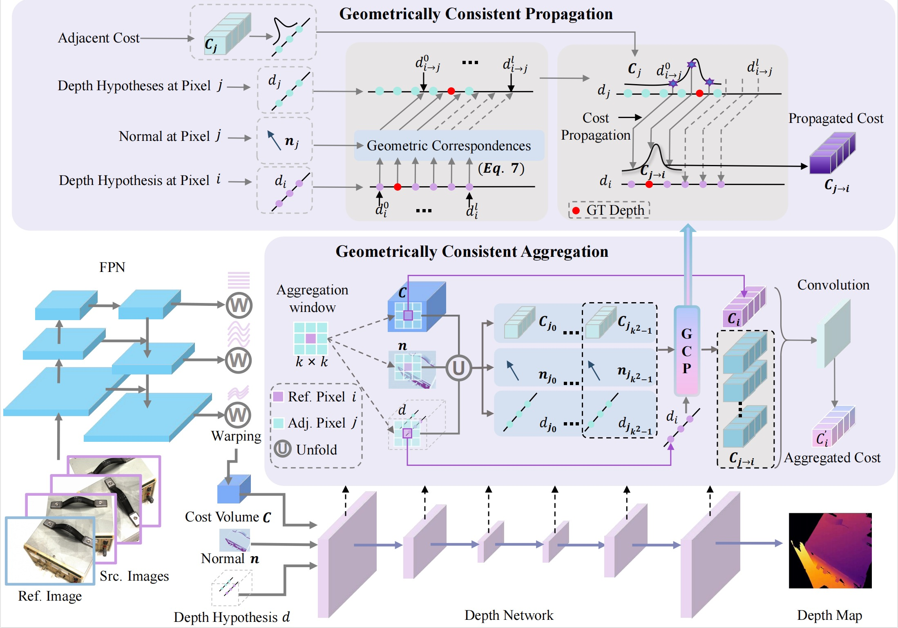

<div align="center">
<h1>🦿GoMVS: Geometrically Consistent Cost Aggregation for Multi-View Stereo</h1>

[**Jiang Wu**]()<sup>1</sup> [**Rui Li**](https://ruili3.github.io/)<sup>1,2</sup> · [**Haofei Xu**](https://haofeixu.github.io)<sup>2,3</sup> · [**Wenxun Zhao**](https://github.com/adaxun/)<sup>1</sup> · [**Yu Zhu**]()<sup>1</sup> <br>
[**Jinqiu Sun**]()<sup>1</sup> · [**Yanning Zhang**]()<sup>1</sup>

<sup>1</sup>Northwestern Polytechnical University  · <sup>2</sup>ETH Zürich  · <sup>3</sup>University of Tübingen, Tübingen AI Center

**CVPR 2024**

💨
<a href='https://wuuu3511.github.io/gomvs'></a>
<a href=''></a>
</div>


## ☁ Introduction
In this paper,
we propose GoMVS to aggregate geometrically consistent costs, yielding better utilization of adjacent geometries. Specifically, we correspond and propagate adjacent costs to the reference pixel by leveraging the local geometric smoothness in conjunction with surface normals. We achieve this by the geometric consistent propagation (GCP) module. It computes the correspondence from the adjacent
depth hypothesis space to the reference depth space using surface normals, then uses the correspondence to propagate adjacent costs to the reference geometry, followed by a convolution for aggregation. Our method achieves new
state-of-the-art performance on DTU, Tanks & Temple, and ETH3D datasets. Notably, our method ranks 1st on the
Tanks & Temple Advanced benchmark.



## ⛏ Installation
```
conda create -n gomvs python=3.8 # use python 3.8
conda activate gomvs
pip install -r requirements.txt
#Our code is tested on NVIDIA A100 GPUs (with python=3.8 ,pytorch=1.12, cuda=11.6)
```

## ⏳ Dataset
We first train the model on DTU dataset and then fine-tune on the BlendedMVS dataset.

### 💾	 DTU
You can download the [DTU training data](https://drive.google.com/file/d/1eDjh-_bxKKnEuz5h-HXS7EDJn59clx6V/view)
 and [Depths_raw](https://virutalbuy-public.oss-cn-hangzhou.aliyuncs.com/share/cascade-stereo/CasMVSNet/dtu_data/dtu_train_hr/Depths_raw.zip)
 (preprocessed by [MVSNet](https://github.com/YoYo000/MVSNet)), and unzip them like:
```
dtu_training
 ├── Cameras
 ├── Depths
 ├── Depths_raw
 └── Rectified
```
For DTU testing set, you can also download the preprocessed [DTU testing data](https://drive.google.com/open?id=135oKPefcPTsdtLRzoDAQtPpHuoIrpRI_) and unzip it as the test data folder, which should be:
```
dtu_testing                            
 ├── Cameras                  
 ├── scan1                   
 ├── scan2               
 ├── ...
```
### 💾	 BlendedMVS
Download the [low-res set](https://drive.google.com/file/d/1ilxls-VJNvJnB7IaFj7P0ehMPr7ikRCb/view) from [BlendedMVS](https://github.com/YoYo000/BlendedMVS) and unzip it like below:

```
BlendedMVS
 ├── 5a0271884e62597cdee0d0eb
 │     ├── blended_images
 │     ├── cams
 │     └── rendered_depth_maps
 ├── 59338e76772c3e6384afbb15
 ├── 59f363a8b45be22330016cad
 ├── ...
 ├── all_list.txt
 ├── training_list.txt
 └── validation_list.txt
```
### 💾	 Tanks and Temples
You can download the [Tanks and Temples](https://drive.google.com/file/d/1YArOJaX9WVLJh4757uE8AEREYkgszrCo/view) here and unzip it. 
For the intermediate set, unzip "short_range_caemeras_for_mvsnet.zip" and replace the camera parameter files inside the "cam" folder with them.
```
tanksandtemples                            
       ├── advanced                   
       │   ├── Auditorium         
       │   ├── ...    
       └── intermediate  
           ├── Family
           ├── ... 
 ```
### 💾	 Normal Maps
We provide the normal maps generated by the [Omnidata](https://github.com/EPFL-VILAB/omnidata) monocular normal estimation network.
We generate high-resolution normals using scripts provided by [MonoSDF](https://github.com/autonomousvision/monosdf) and you can download our preprocessed normal maps.

Download [DTU Training](https://pan.baidu.com/s/1rck2X0bEDpD2Nbu1PjB56w?pwd=pswc) and [DTU Test](https://pan.baidu.com/s/1gNeNcHZvtMKI74sSsbY5QA?pwd=asdg) normal maps and unzip it as follows:
```
dtu_training_normal
 ├── scan1_train
 |    ├── 000000_normal.npy         
 │    ├── 000000_normal.png
 |    ├── ...
 ├── scan2_train
 └── ...
dtu_test_normal
 ├── scan1
 |    ├── 000000_normal.npy         
 │    ├── 000000_normal.png
 |    ├── ...
 ├── scan4
 ├── scan9
 └── ...
```
We also provide the normal maps for the BlendedMVS low-res set.
You can down it [here](https://pan.baidu.com/s/188SLzwcu309_ehp9DYp5Mg?pwd=h5qr).
```
BlendedMVS_normal                             
 ├── 5a0271884e62597cdee0d0eb
 |    ├── 000000_normal.npy         
 │    ├── 000000_normal.png
 │    ├── ...
 ├── 59338e76772c3e6384afbb15
 ├── 59f363a8b45be22330016cad
 └── ...
```
The structure of the [TNT](https://pan.baidu.com/s/17i2wOzl0s0uwF2SMXL3tnQ?pwd=f67q) normal data is as follows.
```
TnT_normal
 ├── Auditorium         
 ├── ...    
 ├── Family
 ├── ... 
 |    ├── 000000_normal.npy         
 │    ├── 000000_normal.png
 |    ├── ...
```


## ⚽ Running
We provide scripts in the 'scripts' folder for training and testing on different datasets. 
Before running, please configure the paths in the script files.

Specify ``MVS_TRAINING`` and ``NORMAL_PATH`` in ``scripts/train/*.sh``.

Then, you can run the script to train the model on DTU dataset:
```
bash scripts/train/train_dtu.sh
```
To finetune the model on BlendedMVS, set ``CKPT`` as path of the pre-trained model on DTU dataset. Then run:
```
bash scripts/train/train_bld_fintune.sh
```

To start testing on DTU, set the configuration in ``scripts/test/test_dtu.sh``,
and run:
```
bash scripts/test/test_dtu.sh
```
For testing on the TNT dataset, use 'test_tnt.sh' to generate depth maps and 'dynamic_fusion.sh' to generate the final point results.
```
bash scripts/test/test_tnt.sh
bash scripts/test/dynamic_fusion.sh
```
Setting ``CKPT_FILE`` to the fine-tuned model may yield better results.


## 📖 Results
### Results on DTU dataset <a id="section_dtu"></a>

|  Methods | Acc.   | Comp.  | Overall. |
|-------|--------|--------|----------|
| GoMVS[(Pre-trained model)](https://drive.google.com/file/d/1e-rSIQAWMkjt7Ymk7feKnbN8PQvJs8_g/view?usp=drive_link)| 0.347| 0.227| 0.287|


### Results on Tanks and Temples benchmark <a id="section_tnt"></a>

| Methods| Mean | Aud.| Bal.| Cou.| Mus.| Pal.| Temp.| 
|--------|--------|--------|---------|--------|------------|--------|---------|
| GoMVS[(Pre-trained model)](https://drive.google.com/file/d/19Dk3eraHtWR2qYFyh7ilWEkmysxSftT4/view?usp=drive_link)| 43.07 |35.52| 47.15 |42.52 |52.08 |36.34 |44.82|

| Methods| Mean | Fam.| Fra.| Hor.| Lig.| M60| Pan.| Pla.| Tra.|
|--------|--------|--------|---------|--------|------------|--------|---------|--------|---------|
| GoMVS[(Pre-trained model)](https://drive.google.com/file/d/19Dk3eraHtWR2qYFyh7ilWEkmysxSftT4/view?usp=drive_link)| 66.44|82.68 | 69.23| 69.19|63.56| 65.13| 62.10|58.81|60.80|

## 📰 Citation
 
Please cite our paper if you use the code in this repository:
```
@inproceedings{wu2024gomvs,
        title={GoMVS: Geometrically Consistent Cost Aggregation for Multi-View Stereo},
        author={Wu, Jiang and Li, Rui and Xu, Haofei and Zhao, Wenxun and Zhu, Yu and Sun, Jinqiu and Zhang Yanning},
        booktitle={CVPR},
        year={2024}
      }
```

## 📨 Acknowledgments
We borrow the code from [TransMVSNet](https://github.com/megvii-research/TransMVSNet), [GeoMVSNet](https://github.com/doubleZ0108/GeoMVSNet), [IronDepth](https://github.com/baegwangbin/IronDepth). We express gratitude for these works' contributions!
